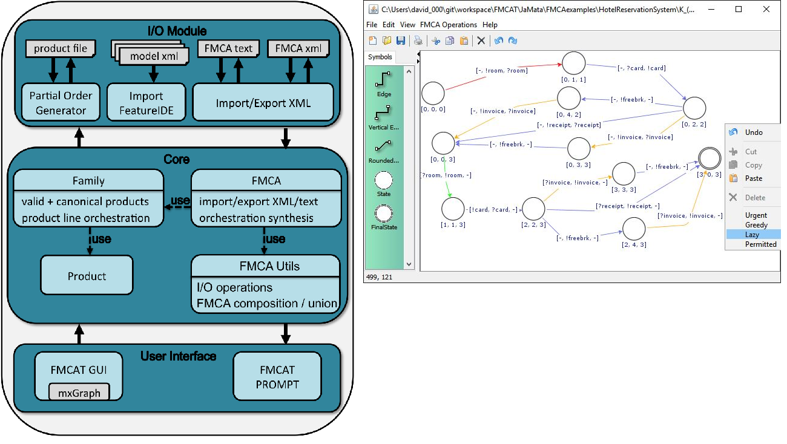

<h1>Info</h1>

The directory JaMaTa contains the FMCA Tool. 

FMCA Tool is built on top of JaMaTa,  an earlier prototypical tool for managing different automata models. 
The tool is still prototypical and under development. 
At the actual stage, it has been mainly used by the authors for developing the theory regarding FMCA, and the earlier formalisms MSCA and CA. 

We are working  on improving its usability for potential users and we are searching for developer working on this matter.

FMCAT features both a GUI (based on mxGraph) and a command line interface (deprecated). 

Software developed with Eclipse and JavaSE-1.8, 1.7

- FMCA (Featured Modal Service Contract Automata) extends CA
- CA (Contract Automata) see CAT repository for more informations on CA

<h1>Tutorials</h1>
A first video tutorial is available at https://www.youtube.com/watch?v=LAzCEQtYOhU  and it shows the usage of the tool for composing automata and compute orchestrations of product lines, using the examples published in JSCP2020.
The directory demoJSCP contains an executable jar and the models used in this tutorial.

The second video tutorial, https://youtu.be/W0BHlgQEhIk, shows the computation of orchestrations and choreographies for the examples published in LMCS2020.
The directory demoLMCS2020 contains an executable jar and the models used in this tutorial.

<h1>Documentation</h1>

Further documentation for this tool and Featured Modal Contract Automata is available at:

Basile, D., ter Beek, M.H., Degano, P., Legay, A., Ferrari, G.L., Gnesi, S. and Di Giandomenico, F., 2020. Controller synthesis of service contracts with variability. Science of Computer Programming, 187, p.102344.
https://www.sciencedirect.com/science/article/pii/S0167642318302260

Basile, Davide, Maurice H. ter Beek, and Rosario Pugliese. "Bridging the gap between supervisory control and coordination of services: synthesis of orchestrations and choreographies." In International Conference on Coordination Languages and Models, pp. 129-147. Springer, Cham, 2019.
https://arxiv.org/abs/1910.00849

Basile, D., Beek, M.H.T. and Gnesi, S., 2018, September. Modelling and analysis with featured modal contract automata. In Proceedings of the 22nd International Systems and Software Product Line Conference-Volume 2 (pp. 11-16).
https://doi.org/10.1145/3236405.3236408

Basile, D., Di Giandomenico, F. and Gnesi, S., 2017, September. FMCAT: supporting dynamic service-based product lines. In Proceedings of the 21st International Systems and Software Product Line Conference-Volume B (pp. 3-8).
https://doi.org/10.1145/3109729.3109760

Basile, D., ter Beek, M.H., Di Giandomenico, F. and Gnesi, S., 2017, September. Orchestration of dynamic service product lines with featured modal contract automata. In Proceedings of the 21st International Systems and Software Product Line Conference-Volume B (pp. 117-122).
https://doi.org/10.1145/3109729.3109741

