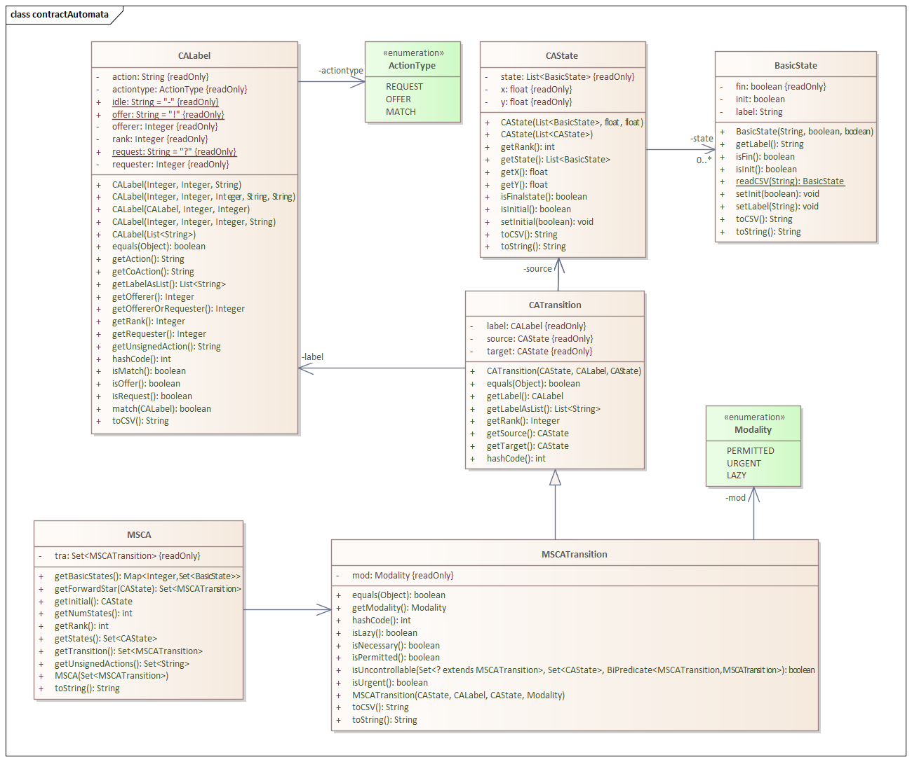
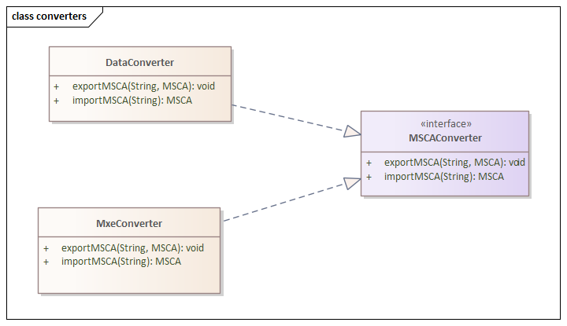
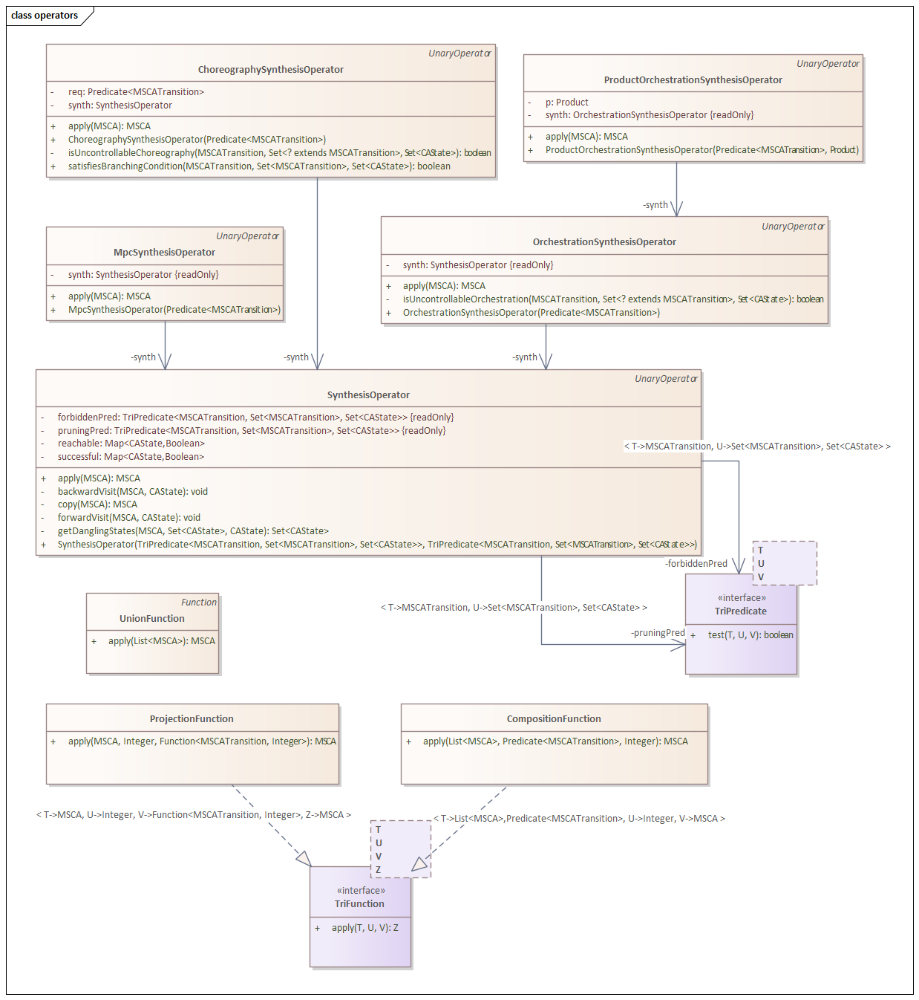
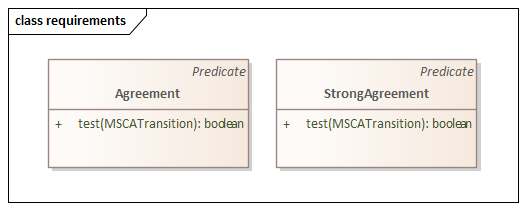
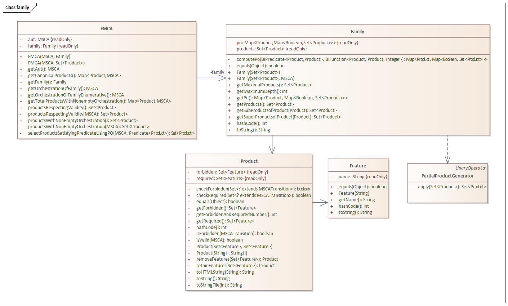
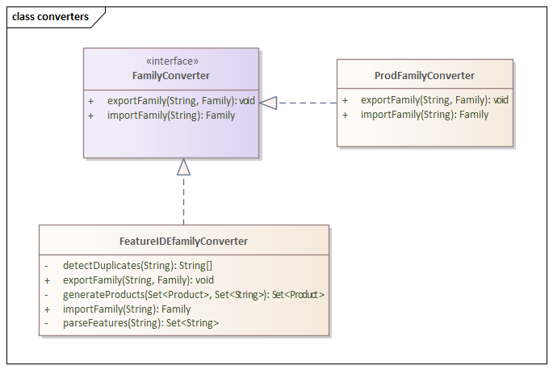

## Welcome


The Contract Automata Tool is an ongoing basic research activity about implementing 
and experimenting with new developments in the theoretical framework of Contract Automata (CA).
Contract automata are a formalism developed in the research area of foundations for services and distributed 
computing.
They are used for specifying services' interface, called behavioral contracts, 
 as finite-state automata, with functionalities for composing contracts and generating the 
 orchestration or choreography of a composition of services, and with extensions to modalities (MSCA) and product 
 lines (FMCA).

<h2>Install</h2>

The Contract Automata Library is released in the Maven Central Repository, simply add this dependency to the `pom.xml` 
of your Maven project.

```xml
<dependency>
  <groupId>io.github.davidebasile</groupId>
  <artifactId>ContractAutomataLib</artifactId>
  <version>0.0.1</version>
</dependency>
```

<h2>Usage</h2>

The following code snippets are examples taken from the test folder `test/exampleTest` of the github repository.
The first  snippet loads two CA described in `.data` format, computes their composition and synthesises
an orchestration enforcing agreement (all requests are matched). 
The composition takes two other arguments. 
The second is a predicate used to avoid generating portions of the automaton only reachable by transitions 
 violating the predicate that we will enforce with the orchestration. 
Indeed, the orchestration synthesis would prune these transitions anyway.
This allows to scale up to bigger compositions without losing information.
The third is a bound to the maximum length of a path in the composition. 

```java
final String dir = System.getProperty("user.dir")+File.separator+"CAtest"+File.separator;
MSCAConverter bdc = new DataConverter();
List<MSCA> aut = new ArrayList<>(2);	
aut.add(bdc.importMSCA(dir+"BusinessClient.mxe.data"));//loading textual .data description of a CA
aut.add(bdc.importMSCA(dir+"Hotel.mxe.data"));
MSCA comp = new CompositionFunction().apply(aut, new Agreement().negate(),100);
MSCA orc = new OrchestrationSynthesisOperator(new Agreement()).apply(comp);
```

This snippet loads a composition stored in a `.data` format, synthesises the choreography enforcing 
strong agreement (all requests and offers are matched) and stores it in a .data format.
```java
MSCAConverter bdc = new DataConverter();
MSCA aut = bdc.importMSCA(dir+"(ClientxPriviledgedClientxBrokerxHotelxHotel).mxe.data");
MSCA cor = new ChoreographySynthesisOperator(new StrongAgreement()).apply(aut);
bdc.exportMSCA(dir+"Chor_(ClientxPriviledgedClientxBrokerxHotelxHotel).data",cor);
```

The following snippet loads an MSCA in `.mxe` format, that is the format used by the GUI app. 
It synthesises an orchestration enforcing agreement for a specific product (i.e., a configuration), 
requiring features `card` and `sharedBathroom`, and forbidding feature `singleRoom`.
```java
MSCA aut = new MxeConverter().importMSCA(dir+"(BusinessClientxHotelxEconomyClient).mxe");		
Product p = new Product(new String[] {"card","sharedBathroom"}, new String[] {"singleRoom"});
MSCA orc = new ProductOrchestrationSynthesisOperator(new Agreement(),p).apply(aut);	
```

The following snippet imports a product line (i.e., a family) using the textual format `.prod`. 
In this example the Family is generated independently from the automaton. 
Two different MSCA are used, both are paired with the family into an FMCA. 
An orchestration of a product is computed.

```java
MSCA aut = new MxeConverter().importMSCA(dir+"(BusinessClientxHotelxEconomyClient).mxe");
MSCA aut2 = new MxeConverter().importMSCA(dir+"BusinessClientxHotel_open.mxe");

FamilyConverter dfc = new ProdFamilyConverter();

// import from .prod textual description of products
Set<Product> sp = dfc.importProducts(dir+"ValidProducts.prod");

//ValidProducts.prod contains also partial products, no need to generate them.
//The family is generated without being optimised against an MSCA.
//This is useful when different plant automata (FMCA) are used for the same family.
Family fam =  new Family(sp);

//two different FMCA may be using the same family
FMCA faut = new FMCA(aut,fam);
FMCA faut2 = new FMCA(aut2,fam);

//selecting a product of first FMCA and computing its orchestration
Product p = faut.getFamily().getProducts().iterator().next(); 
MSCA orcfam1 = new ProductOrchestrationSynthesisOperator(new Agreement(),p).apply(faut.getAut());
```


The following snippet imports a product line as a `.xml` FeatureIDE model (whose products are generated by FeatureIDE). 
FeatureIDE does not generate partial products, which are generated using `PartialProductGenerator`.
The set of products is passed to the constructor of the FMCA, this will exploit the information on the actions 
of the automaton to refine the set of products, discarding redundant ones.
The orchestration of a product of the family is synthesised.

```java
MSCA aut = new MxeConverter().importMSCA(dir+"(BusinessClientxHotelxEconomyClient).mxe");
	
//import from FeatureIDE model the products generated by FeatureIDE
FamilyConverter ffc = new FeatureIDEfamilyConverter();
Set<Product> sp2 = ffc.importProducts(dir+"FeatureIDEmodel"+File.separator+"model.xml"); 

//in case the products are imported from FeatureIDE, 
//the partial products not generated by FeatureIDE are generated first.
//The FMCA constructors below optimises the product line against the automaton.
FMCA faut = new FMCA(aut,new PartialProductGenerator().apply(sp2));

//selecting a product of the family and computing its orchestration
Product p = faut.getFamily().getProducts().iterator().next(); 
MSCA orcfam1 = new ProductOrchestrationSynthesisOperator(new Agreement(),p).apply(faut.getAut());
```


The following snippet imports a product line as a `.dimac` file. 
Dimac constructor has a parameter, if true all products are generated, 
otherwise only maximal products are generated.
Avoiding the generation of all products and partial products greatly improve 
performances. This is useful if only the orchestration of the product line is to 
be synthesised, and there is no need to operate on a single product.

```java
MSCA aut = new MxeConverter().importMSCA(dir+"(BusinessClientxHotelxEconomyClient).mxe");

//false parameter means that only maximal products (models of the formula) are generated, 
//if true all products (models of the formula) are imported
FamilyConverter dimfc = new DimacFamilyConverter(false);

//import Dimac CNF formula models. Dimac file has been created using FeatureIDE export
Set<Product> sp3 = dimfc.importProducts(dir+"FeatureIDEmodel"+File.separator+"model.dimacs"); 

//in case only the orchestration of the family is to be computed, it is faster
//to only import the maximal products using dimac converter, avoiding the 
//processing of all products and partial products
FMCA faut = new FMCA(aut,sp3);
MSCA orcfam2 = faut.getOrchestrationOfFamily();	
```

<h2>Videos</h2>
Check the <a href="https://www.youtube.com/playlist?list=PLory_2tIDsJvZB2eVlpji-baIz0320TwM">playlist of video tutorials and presentations</a> about CAT.


<h2>License</h2>
The tool is available under <a href="https://www.gnu.org/licenses/gpl-3.0">GPL-3.0 license</a>.


<h2> API Documentation</h2>

This software has been developed also using the Model-based Software Engineering tool Sparx Enterprise Architect. 
The following documentation has been generated for the commit d92c4b6 of 8 December 2021. 
<ul>
  <li> <a href="https://davidebasile.github.io/ContractAutomataLib/site/index.htm">Online documentation</a>.
</li>
  <li><a href="https://davidebasile.github.io/ContractAutomataLib/doc/CAT_Lib_diagrams.pdf">Diagram report (pdf)</a></li>
  <li><a href="https://davidebasile.github.io/ContractAutomataLib/doc/CAT_Lib_doc.pdf">Library report (pdf)</a></li>
</ul> 

The javadoc documentation for the release to the Maven Central Repository is available at <a href="https://javadoc.io/doc/io.github.davidebasile/ContractAutomataLib/latest/overview-summary.html">https://javadoc.io/doc/io.github.davidebasile/ContractAutomataLib/latest/overview-summary.html</a>.


<!--
<h2>Package Structure</h2>

The structure of the Contract Automata Tool Library is composed of two  packages:

**automaton** This package and the others contained are the core of the tool. 
A CA is defined by the class `MSCA`. 
Several operations are available: composition, projection, union, 
synthesis of  orchestration, choreography, or most permissive controller.
These operations are extending corresponding functional interfaces and are using the class MSCA.
The Java classes `DataConverter` and `MxeConverter`, implementing 
the interface `MSCAConverter`,   are used for the storing of file descriptors.
There are two types of formats: 
An automaton is stored in either a readable textual representation
(`*.data`) or an XML format (`*.mxe)`. The `*.data` format can be 
used by any textual editor and it consists of a textual
declaration of states and transitions of each automaton. The XML
representation of a contract (`*.mxe`) is used by the GUI (mxGraph) for saving and
loading CA. This file descriptor also stores information related to
the graphical visualization of the CA.  
A JsonConverter is also under construction.
Below are the class diagram of the packages automatically generated by Sparx Enterprise Architect.










**family** 
This package contains the classes `Family` containing a set of products  `Product` composing a given product line.  
`FamilyConverter` is an interface for storing and loading a family, either as `*.prod`  textual description of a product line, as well as for importing 
an `.xml` description of a feature model designed in FeatureIDE, whose products have already been generated by FeatureIDE. 
When importing from FeatureIDE, the sub-families are also generated, called partial products.
`Family` organises the products into a partial order (variable `po`), and there are methods for accessing adjacent products 
of a product in the partial ordering relation.
Each object of  `Product` contains two sets of features (required and forbidden) described in `Feature`.
The class `FMCA` contains an MSCA object and its corresponding Family. 
`FMCA`  contains the methods for computing the products respecting validity of a family (see references JSCP2020), 
for computing the canonical products and their union  (the service product line).
The synthesis of the orchestration of a product is an operation implementing a functional interface and using both `Product` and `MSCA`.
The wiki contains an excerpt from a published paper regarding the product lines functionalities of the tool.




-->

<h2>Editing</h2>

The Contract Automata Library is a back-end and new front-ends can be developed for 
editing or automatically generating contracts (e.g., from static analysis tools), using this library.

The <a href="https://github.com/davidebasile/ContractAutomataApp">Contract Automata App</a> is 
a GUI front-end allowing to graphically edit and export contract automata in a `.mxe` format.

A textual `.data` format is also supported, as well as a `.json` format (still under development).
This is an example of the `PriviledgedClient.data` principal contract automaton taken from [LMCS20]. 
This contract has rank 1, initial state is `[0]`, final states are `[4]`,`[0]` and `[3]`. 
This contract has been created using the GUI app and has been exported in the `.data` format.
It has four transitions, descripted by indicating the source state, label and target state.
A necessary lazy transition is prefixed by `!L` whilst a necessary urgent transition is prefixed by `!U`. 

```c
Rank: 1
Initial state: [0]
Final states: [[4, 0, 3]]
Transitions: 
([1],[?bestoffer],[2])
!L([0],[!contact],[1])
([2],[!reject],[4])
([2],[!accept],[3])
```

This is an example of the choreography automatically computed by the library, the example is taken from [LMCS20].

```c
Rank: 5
Initial state: [0, 0, 0, 0, 0]
Final states: [[0][0, 4, 3][8, 0, 14][4, 0, 3][4, 0]]
Transitions: 
([0, 1, 3, 1, 0],[-, -, ?ans, !ans, -],[0, 1, 5, 2, 0])
([0, 2, 6, 2, 2],[-, !accept, ?accept, -, -],[0, 3, 7, 2, 2])
!L([0, 0, 0, 0, 0],[-, !contact, ?contact, -, -],[0, 1, 1, 0, 0])
([0, 3, 9, 3, 2],[-, -, !nobook, -, ?nobook],[0, 3, 8, 3, 4])
([0, 1, 11, 2, 2],[-, ?bestoffer, !bestoffer, -, -],[0, 2, 6, 2, 2])
([0, 1, 5, 2, 0],[-, -, !check, -, ?check],[0, 1, 10, 2, 1])
([0, 3, 7, 2, 2],[-, -, !book, ?book, -],[0, 3, 9, 3, 2])
([0, 1, 10, 2, 1],[-, -, ?ans, -, !ans],[0, 1, 11, 2, 2])
([0, 4, 13, 2, 4],[-, -, !nobook, ?nobook, -],[0, 4, 14, 4, 4])
([0, 1, 1, 0, 0],[-, -, !check, ?check, -],[0, 1, 3, 1, 0])
([0, 4, 12, 2, 2],[-, -, !nobook, -, ?nobook],[0, 4, 13, 2, 4])
([0, 2, 6, 2, 2],[-, !reject, ?reject, -, -],[0, 4, 12, 2, 2])
```

In this case, the contract automaton is of rank 5. 
Note that the final states of each principal are separately reported. 
In a final state of the composed automaton it is required that all principals are in a final state (e.g., `[0, 4, 14, 4, 4]` is a final state).

See the references below for more informations on the contract automata formalism.

<h2>Contacts</h2>

If you have any question or want to help contact me on davide.basile@isti.cnr.it.


<h2>References</h2>

[COORD21] Basile, D., ter Beek, M.H., 2021, June. A Clean and Efficient Implementation of Choreography Synthesis for Behavioural Contracts. 
In Proceedings of the 23rd IFIP WG 6.1 International Conference, COORDINATION 2021, pages 225-238, 
https://doi.org/10.1007/978-3-030-78142-2_14
(pdf at https://openportal.isti.cnr.it/data/2021/454603/2021_454603.postprint.pdf)

[SPLC17] Basile, D., Di Giandomenico, F. and Gnesi, S., 2017, September. FMCAT: Supporting Dynamic Service-based Product Lines. In Proceedings of the 21st International Systems and Software Product Line Conference (SPLC'17), Volume B. ACM, pp. 3-8.
https://doi.org/10.1145/3109729.3109760
(pdf at http://openportal.isti.cnr.it/data/2017/386222/2017_386222.postprint.pdf)

[SPLC18] Basile, D., ter Beek, M.H. and Gnesi, S., 2018, September. Modelling and Analysis with Featured Modal Contract Automata. In Proceedings of the 22nd International Systems and Software Product Line Conference (SPLC'18), Volume 2. ACM, pp. 11-16.
https://doi.org/10.1145/3236405.3236408
(pdf at http://openportal.isti.cnr.it/data/2018/391612/2018_391612.postprint.pdf)

Further documentation:

[SCICO20] Basile, D., ter Beek, M.H., Degano, P., Legay, A., Ferrari, G.L., Gnesi, S. and Di Giandomenico, F., 2020. Controller synthesis of service contracts with variability. Science of Computer Programming, vol. 187, pp. 102344.
https://doi.org/10.1016/j.scico.2019.102344
(pdf at https://openportal.isti.cnr.it/data/2019/409807/2019_409807.published.pdf)

[LMCS20] Basile, D., ter Beek, M.H. and Pugliese, R., 2020. Synthesis of Orchestrations and Choreographies: Bridging the Gap between Supervisory Control and Coordination of Services. Logical Methods in Computer Science, vol. 16(2), pp. 9:1 - 9:29.
https://doi.org/10.23638/LMCS-16(2:9)2020
(pdf at http://openportal.isti.cnr.it/data/2020/423262/2020_%20423262.published.pdf)

[DSPL17] Basile, D., ter Beek, M.H., Di Giandomenico, F. and Gnesi, S., 2017, September. Orchestration of Dynamic Service Product Lines with Featured Modal Contract Automata. In Proceedings of the 21st International Systems and Software Product Line Conference (SPLC'17), Volume B. ACM, pp. 117-122.
https://doi.org/10.1145/3109729.3109741
(pdf at http://openportal.isti.cnr.it/data/2017/376406/2017_376406.postprint.pdf)

[MOD17] Basile, D., Di Giandomenico, F. and Gnesi, S., 2017, February. Enhancing Models Correctness through Formal Verification: A Case Study from the Railway Domain. In Proceedings of the 5th International Conference on Model-Driven Engineering and Software Development (MODELSWARD'17), Volume 1. SciTePress, pp. 679-686.
https://doi.org/10.5220/0006291106790686
(pdf at http://openportal.isti.cnr.it/data/2017/386223/2017_386223.preprint.pdf)
